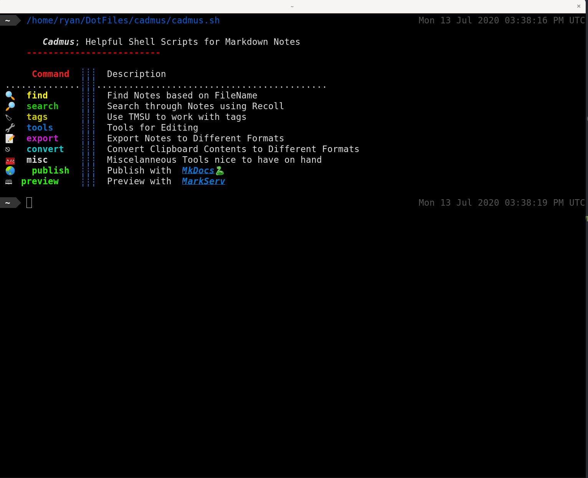
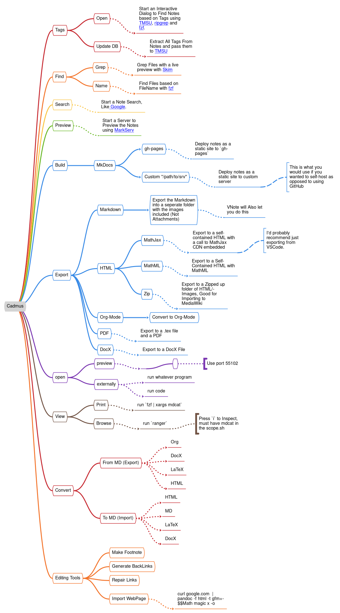

# cadmus
Shell Scripts to Facilitate Effective Note Taking

## Introduction

Essentially I ~~used to~~ have a dozen shell scripts in `~/bin` that I use to capture notes,
this is an attempt to wrap them into a single script and then have aliases to make them quick to access.




## Philosophy

- ****<span style="color:rgb(90,210,90);font-family:Courier New,Courier, monospace,serif;">cadmus</span>**** acts as a menu for scripts to acheive things
    - the script name will always be printed to the terminal so the individual
      script can be used for whatever purpose.
- SubFunctions will take *only one* argument or `STDIN`
    - If the first argument is either `-h` or `--help` help will be printed and then `exit 0`
    - This might lead to some limitations but the simplicity is for sanity, modularity and extensibility.
    - Will always return absolute path.
        - I played around with relative path but it got confusing when calling the script from inside a function inside a script, so instead if you want a relative path you should do `scriptname './' | xargs realpath --relative-to='./'`


-  ****<span style="color:rgb(90,210,90);font-family:Courier New,Courier, monospace,serif;">cadmus</span>**** will take the notes directory from the global variable `CADMUS_NOTES_DIR`
    - The Actual work will be done by subscripts denoted by `description.bash`
        - The subscripts will take the note directory as an argument so they are portable and modular
    - The Arguments will be shifted and then all passed down to subfunctions
        - I'll just need to be careful that loose arguments aren't dangerous
- Be a Front end to tie together different scripts and tools
- Don't replicate work other people have done.
- Plain Text, Open Source.
- Be Modular
    - Pipe in input, output goes to STDOUT
    - Leave Aliases and piping to the user
        - See [Recommended Aliases](#recommended-aliases)

## Installation

To install, satisfy [the dependencies](#Dependencies) and add `$HOME/bin` to the `$PATH` variable, something like this should be fairly shell agnostic:

``` bash
echo $PATH | grep "$HOME/bin" &> /dev/null && echo "$HOME/bin in path already" || ls "$HOME/bin" &> /dev/null && echo 'PATH="$PATH:$HOME/bin"' >> $HOME/.profile

```

then copy in the scripts, with [*stow*] something like this should be sensible:

```bash
exec bash
cd ~/DotFiles

if [[ -d ".git" ]]; then
    echo "Adding Submodule";
    git submodule add https://github.com/RyanGreenup/cadmus
else echo "Cloning Repository";
    git clone https://github.com/RyanGreenup/cadmus
fi

stow -t $HOME -S cadmus
```

|:warning: WARNING                                                                      |
| ---                                                                                   |
| Stow is [currently broken][stowIssue] on Arch If you are using Stow 2.3.1-2 downgrade |
> Downgrade with:
> sudo pacman -U https://archive.archlinux.org/packages/s/stow/stow-2.2.2-5-any.pkg.tar.xz

[stowIssue]: https://github.com/aspiers/stow/issues/65

## Usage


It's all Menu driven so just follow the diagram to do what you need.



### Assumptions

It is assumed that:

1. notes are:
    1. *Markdown* files with a `.md` extension
    2. Underneath `~/Notes`
    3. Recoll updates it's index on the fly
        * `~/Notes` will need to be indexed by *Recoll* so the results will show up.
2. You're going to use [Kitty](https://sw.kovidgoyal.net/kitty/)
    * You could either change the source or use anoter terminal that supports
      calling functions with `--`, e.g. `kitty -- nvim`
3. SSD
    * I use an SSD and some scripts are pretty inefficient (like `grep | cut |
      xargs find` to avoid creating a variable), I don't know if things like
      would work on a HDD.
4. SystemD
    * or atleast have `tmpfs` mounted at `/dev/shm` ([See the Arch Wiki: tmpfs][tmpfs]) [^wpdtmpfs]
5. All Notes have Unique Names
5. I use [*Fish*] and *Oh My Fish* ([*OMF*]) as my default shell, this means `basename $SHELL` is `fish` for
   me and even though this is written in `bash` maybe that could cause issues.
    * Try [*Fish*] for a while, it's quite good, when you need to test something
      it's easy to temporarily jump back with `exec zsh`.
    * This should only matter for `cadmus find` where the use of [*Fish*] mmeans
      that results can be highlighted, I cannot get this to work with `bash` or
      `zsh` and I don't know why.
        * I wonder if this would work for [*nushell*]???
    * On *MacOS* you'll need to define `xdg-open` so something like:
        ```bash
        alias xdg-open='open &>/dev/null' 
        ```


[*nushell*]: https://github.com/nushell/nushell
[*Fish*]:    https://fishshell.com/
[*OMF*]:     https://github.com/oh-my-fish/oh-my-fish

## Dependencies

- [R](https://en.wikipedia.org/wiki/R_(programming_language))
- [highlight](https://www.archlinux.org/packages/community/x86_64/highlight/)
- [recode](https://www.archlinux.org/packages/extra/x86_64/recode/)
- [node](https://nodejs.org/en/)
- [nvim](https://neovim.io/)
- [fzf](https://github.com/junegunn/fzf)
- [code](https://github.com/lotabout/skim)
- [sk](https://github.com/lotabout/skim)
- [rg](https://www.google.com/search?client=firefox-b-d&q=ripgrep+github)
- [perl](https://wiki.archlinux.org/index.php/Perl)
- [*stow*]
- [python](https://www.python.org/download/releases/3.0/)
- [tmsu](https://aur.archlinux.org/packages/tmsu/)<sup>AUR</sup>
- [ranger](https://www.archlinux.org/packages/community/any/ranger/)
- [mdcat](https://aur.archlinux.org/packages/mdcat/)<sup>AUR</sup>
  - [Kitty](https://sw.kovidgoyal.net/kitty/) 
      - I've also heard good things about [iterm2](https://www.iterm2.com/)
- [xclip](https://www.archlinux.org/packages/extra/x86_64/xclip/)
- [sd](https://github.com/chmln/sd)
- [fd](https://github.com/sharkdp/fd)
- [sed](https://www.gnu.org/software/sed/)
- [cut](https://www.gnu.org/software/coreutils/manual/html_node/The-cut-command.html)
- [grep](https://www.gnu.org/software/grep/)
- [find](https://man7.org/linux/man-pages/man1/find.1.html)
- [GNU realpath](https://www.gnu.org/software/coreutils/manual/html_node/realpath-invocation.html#realpath-invocation)
- [Recoll](https://www.lesbonscomptes.com/recoll/)
- [MkDocs](https://pypi.org/project/mkdocs-material-extensions/)
    - [MkDocs Material Theme](https://github.com/squidfunk/mkdocs-material)
    - [MkDocs Material Extensions](https://pypi.org/project/mkdocs-material-extensions/)
- [VNote](https://github.com/tamlok/vnote)
- [Pandoc](https://github.com/jgm/pandoc)
- [MarkText](https://github.com/marktext/marktext)
- mdless and imgcat

## Recommended Aliases

TODO

## Related

- [DNote]
- [TNote]
- [Notable] 

[Notable]: https://github.com/notable/notable
[TNote]: https://github.com/tasdikrahman/tnote
[DNote]: https://github.com/dnote
[tmpfs]: https://wiki.archlinux.org/index.php/Tmpfs
[shared_memory]: http://en.wikipedia.org/wiki/Shared_memory

[^wpdtmpfs]: [From Wikipedia][shared_memory] Recent 2.6 Linux kernel builds have started to offer /dev/shm as shared memory in the form of a ramdisk, more specifically as a world-writable directory that is stored in memory with a defined limit in /etc/default/tmpfs.  /dev/shm support is completely optional within the kernel config file. 

[*stow*]: https://www.google.com/search?client=firefox-b-d&q=gnu+stow

## MDCat vs Bat

MdCat looks better and supports images, unfourtunately the preview fails when files have footnotes and for this reason bat was used (bat is also in the Arch repos and supports more file types)
